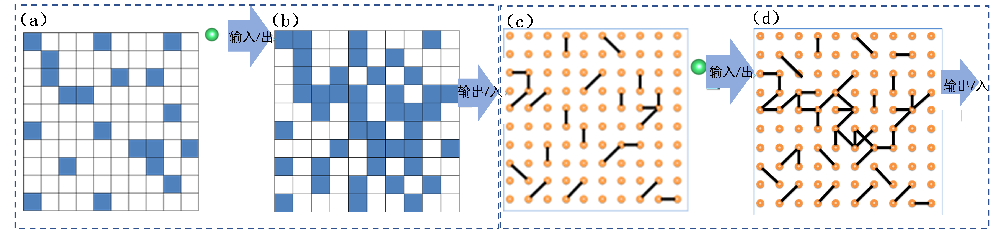
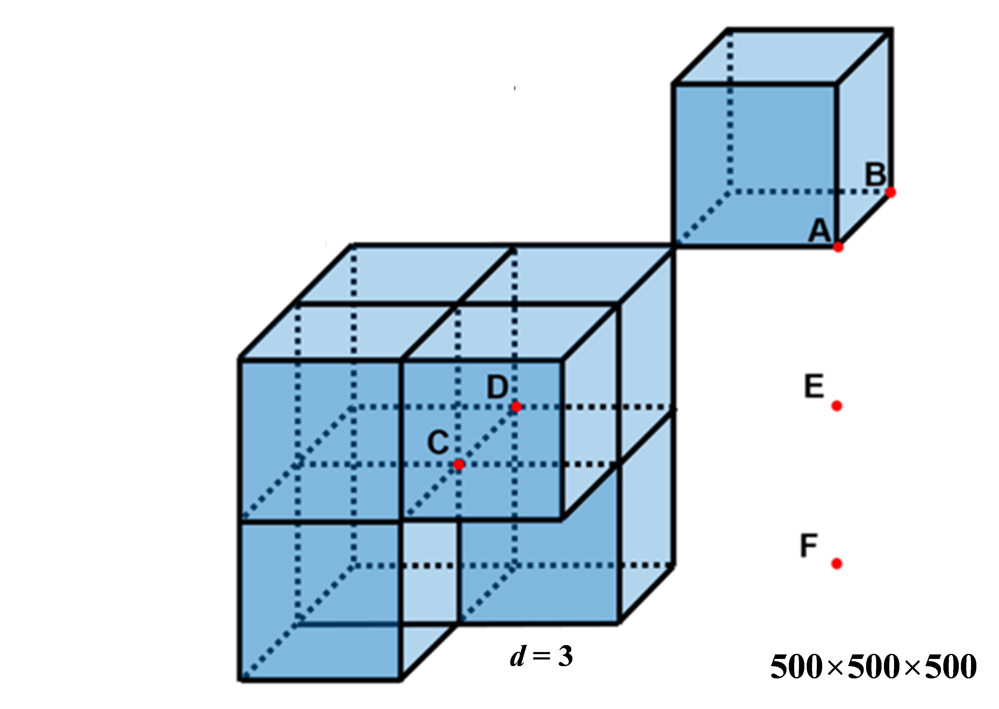
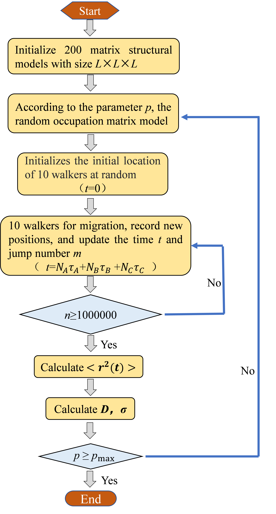

**Composite polymer solid ionic conductivity calculation software V0.1.0**

User Documentation

2023-02-24

# 1 Introduction

## 1.1 Background

Rechargeable lithium-ion batteries have high energy density and are
widely used in electric vehicles and portable electronic devices.
General application. However, due to the flammability of organic liquid
electrolytes, commercial lithium-ion batteries are facing severe
challenges.

Inorganic solid electrolytes and polymer electrolytes are commonly used
in all-solid-state lithium ion batteries. For example,
$\rm Li_{0.33}La_{0.557}TiO_3(LLTO)$, $\rm Li_7La_3Zr_2O_{12}(LLZO)$, $\rm Li_{1.3}Al_{0.3}Ti_{1.7}(PO_4)_3(LATP)$, and $\rm Li_{10}GeP_2S_{12}(LGPS)$ are
inorganic solid electrolytes. They usually have high lithium ion
conductivity (higher than $1×10^{−3} \rm S cm^{−1}$ at room temperature), wide
electrochemical window (\>5V), and good thermal stability. However,
inorganic solid electrolytes have problems such as high brittleness and
large interface impedance between electrolyte and electrode. On the
contrary, polymer electrolytes, such as polyethylene oxide (PEO),
polyacrylonitrile (PAN). Polypropylene carbonate (PPC) and polyvinyl
carbonate (PVCA) have high flexibility, light weight and relatively high
interfacial resistance. However, polymer electrolytes usually have low
lithium ion conductivity, small ion transfer number (\< 0.5), and poor
thermal and electrochemical stability.

The development of inorganic and polymer electrolyte composite
materials, namely composite polymer electrolyte, is to solve the above
problems. Effective strategy of the problem. In the composite polymer
electrolyte, the inorganic solid electrolyte particles are dispersed in
the polymer matrix, and the commonly used inorganic fillers are LLZO and
LLTO. In the composite polymer electrolyte, the polyether-based
composite material has the advantages of low cost, good mechanical
stability, good compatibility with the electrode and good film forming
performance.

## 1.2 Theoretical basis

The incorporation of a second phase into a single-phase solid
electrolyte disrupts the thermodynamic equilibrium of the crystal
defects, changes the ion conduction path and ion migration number, and,
due to mechanical stress, a third phase is created at the interface;
this new phase is known as the interfacial phase. The interfacial phase
arises mainly because some lithium ions located in regular lattice sites
in inorganic fillers move to surface sites and leave negatively charged
vacancies in the lattice while positively charged ions appear on the
surface. The movement of lithium ions to surface positions leaves
negatively charged vacancies in the lattice while positively charged
lithium ions appear on the surface. This process is known as the defect
reaction. These interfacial phases are highly conductive and provide new
conduction paths for ion transport. These interfacial phases are highly
conductive and provide new conduction paths for ion transport.

$\rm Li^+$ therefore involves three diffusion pathways in composite polymer
electrolytes, namely within the matrix material (i.e. polymer)
internally, inside the inorganic filled phase, and the interfacial phase
between the filled phase and the matrix. For the different conduction
pathways, continuous channels need to be formed to constitute a
percolating ion channel, and a high ionic conductivity complex polymer
electrolytes with high ionic conductivity must have at least one
percolation pathway with fast conduction characteristics. Studies have
shown that the enhanced conductivity of composite polymer electrolyte
conductivity is enhanced by the formation of a space charge layer at the
internal interface between the two phases, resulting in The increase in
carrier density and the corresponding increase in interfacial
conductivity.

Therefore, the dispersion of the secondary phase is an effective
strategy to improve the ionic conductivity of solid electrolytes, and
the percolation effect is an important factor in improving the ionic
conductivity of composite polymer solid electrolytes. Achieving
quantitative predictions of conductivity This is of great importance for
the design and development of future composite solid state electrolytes.
This procedure uses percolation theory to predict the electrical
conductivity of polymer-based composite solid state electrolytes and to
target the amount of free flow required for the highest electrical
conductivity of such hybrid solid state electrolytes. The procedure uses
percolation theory to predict the conductivity of polymer-based
composite solid state electrolytes and to target the concentration range
of inorganic dopants required for the highest electrical performance of
such hybrid solid state electrolytes.

## 1.2.2 Development and application of percolation theory

The percolation model is a statistical model developed by Boradbent and
Hammersley in 1957 where the flow of a fluid The flow of a fluid through
a porous medium is called percolation and is used to describe the
movement of a fluid in a random medium. The model is similar to that of
ordinary stochastic processes such as diffusion. The model differs from
the usual stochastic processes (e.g. diffusion) in that the fluid motion
itself is not stochastic, only the medium is. It is only the medium that
has a random nature. Percolation theory can describe many social and
natural phenomena, such as the infection of trees with diseases in
orchards, the spread of forest fires and the dissemination of
information. The theory of percolation can describe many social and
natural phenomena, such as the infection of trees in orchards, the
spread of forest fires and the dissemination of information.

percolation is also a common problem in engineering fields such as
hydropower, geotechnical, oil and gas extraction and geothermal
development, and It can lead to engineering damage failure or poor
energy recovery. By constructing a Percolation model to analyse the
movement pattern of fluids in the medium, the flow rate and the
resulting permeability stability and recovery rate, we can guide the
design and construction of Percolation control for relevant projects. It
also provides a scientific basis for geohazard prediction and efficient
energy extraction.

The classical Percolation models are mainly key Percolation and point
Percolation on a grid point diagram. In a key percolation model, the
space is divided into a series of independent points, each of which has
the potential to be connected to each other. As the size of the
connections increases, a series of clusters of connections will be
formed in the space. Figure 1(a)(b) shows the relationship between a
series of points in a two-dimensional plane. (b) shows a series of
connections between points in a two-dimensional plane. As the number of
connections increases, a network of connections to boundaries will be
formed. network. In addition to bonded Percolation, point Percolation is
also a common Percolation model (e.g. Figure 1(c)(d)). It is important
to emphasise that Percolation models do not necessarily have to be based
on standard grid points, and that arbitrary local interconnections lead
to global connectivity analysis. Any global connectivity analysis
resulting from local interconnections can be called a Percolation
simulation.

Fig. 1 Two-dimensional diagram of several cases regarding percolation.
(a) Bond percolation model with no conduction channel formed; (b) Bond
percolation model with conduction channel formed; (c) Point percolation
model with no conduction channel formed; (d) Bond percolation model with
conduction channel formed. (c) Point percolation model without a
conduction channel; (d) Bond percolation model with a conduction channel

In the 1980s, percolation theory was applied to the study of the
electrical conductivity of ionic conductors. For composite solid
conductors, such as AgI or LiI doped with a second phase of $\rm Al_2O_3$, the ionic conductivity of the resulting hybrid conductor increases, a
phenomenon that can be explained by percolation theory. The researchers
believe that the interface between the first and second phases is highly
conductive and that with the addition of the second phase a long-range
conductive interfacial channel emerges, thus giving the ions a highly
conductive transport channel, the emergence of this long-range
conductive interfacial channel is called \"interfacial percolation\". In
the 21st century, researchers have also identified this phenomenon in
polymer-based composite solid-state electrolytes. The addition of
nanoscale inorganic dopants to polymers can increase the ionic
conductivity of the electrolyte.

Based on this finding, our procedure is to use percolation theory to
predict the conductivity of polymer-based composite solid-state
electrolytes, targeting the range of inorganic dopant concentrations
required for the highest conductivity of such hybrid solid-state
electrolytes. It is divided into two main parts, building a conductivity
model based on two-phase mixture theory and solving for the diffusion
coefficient of the polymer composite solid state electrolyte through a
phase stochastic resistance model and Monte Carlo simulations.

## 1.3 Main functions

\(1\) Calculate the diffusion coefficient of the composite solid
electrolyte system for different doping concentrations

\(2\) Determine the optimum range of filler doping concentrations for
the composite solid electrolyte to achieve the highest conductivity

# 2 Functional modules and key algorithms

## 2.1 Functional modules

The main functional module of the program is divided into two parts: the
first part is based on a random resistance model to build a two-phase
lattice model based on a random resistance model; the second part is a
Monte Carlo simulation in which walkers are randomly The second part is
a Monte Carlo simulation in which the walkers are randomly walked over
the lattice model, sample data is recorded and physical parameters are
calculated.

Figure 2 Schematic diagram of the two-phase hybrid lattice model

Firstly, regarding the construction of the two-phase hybrid lattice
model, a $\rm 500\times 500\times 500$ lattice gas model is constructed in 3D space (as
shown in Figure 2), in which $\rm 500\times 500\times 500\times P$ lattice sites are randomly
occupied ($\rm P$ denotes the doping concentration of inorganic substances) to
represent the randomly filled inorganic substances in the polymer
matrix. The bonds connecting two adjacent lattice sites can be
considered as resistors and three types of bonds exist in the model. (1)
Highly conductive bonds AB bond, the number of its surrounding four
lattice sites occupied by inorganic substances can be one, two or three,
the bond (2) CD bond, where all four surrounding lattice sites are
occupied by dopants, indicating an inorganic bond; (3) the last type is
a polymer bond, where none of the four surrounding sites are occupied by
inorganic dopants. (3) the last type (EF) is a polymer bond where none
of the four surrounding sites are occupied by inorganic matter. The
walkers in the system migrate along these three bonds.

Once the model has been constructed, Monte Carlo simulations are used to
solve for the diffusion constants of the system. In order to
quantitatively determine the diffusion constants of the composite
conductor, the main input parameters of the program are three τ, which
represent the time steps required for walkers to successfully pass
through each of the three types of bonds. After initialising the
structure, the walkers are allowed to perform random walks, and when
enough steps have been migrated, the structure is then used as a base.
When the number of steps is large enough, the mean square displacement
of the walkers is proportional to the diffusion coefficient. The
Nernst-Einstein equation is satisfied. Therefore, we can record the
location of the physical coordinates of the walkers\' migration and the
corresponding time. The mean square displacement of the system can be
calculated by recording the physical coordinate positions of the walkers
and the corresponding time, and furthermore, the diffusion coefficient
can be found. From this This allows us to predict the conductivity of
polymer-based composite solid state electrolytes.

## 2.2 Key algorithms

（1）initial_structure

The module implements the function of initializing the composite polymer
conductor structure, including the size of the model, the occupation of
the inorganic phase, and the initial site state of the walkers.

（2）ions_jumping_process

This module implements the algorithm of how walkers choose to migrate.

（3）samples_to_generate

The module is used to record the information of each step of walkers
migration, including time step and site coordinates.

（4）parameter_calculation

The module implements the ionic conductivity calculation algorithm, and
solves the ionic conductivity according to the Nernst Einstein equation
by recording enough walkers migration information.

## 2.3 programming controls

Figure 3 Program design flow chart

# 3 Operating environment and usage method

## 3.1 Operating environment

Hardware requirements:

- Processor: Intel or AMD dual-core, frequency 1G and above
- Memory: 4GB and above

Software requirements:

- Operating system: Windows 7 and above
- Python 3
- pandas 1.3.2
- pip 21.2.2
- python-dateutil 2.8.2
- pytz 2021.1
- setuptool 57.4.0
- six 1.16.0

## 3.2 Installation tutorial

The dependent packet information is stored in the requirements.txt file.

Installation command: pip intall erpipc

## 3.3Instructions for use

After the installation is completed according to 3.1 and 3.2, the
parameters P, tao_a, tao_b, tao_c are set in the parameter_calculation
module, and then the program is run to generate a file of sample0, which
saves the calculation results of ionic conductivity.

